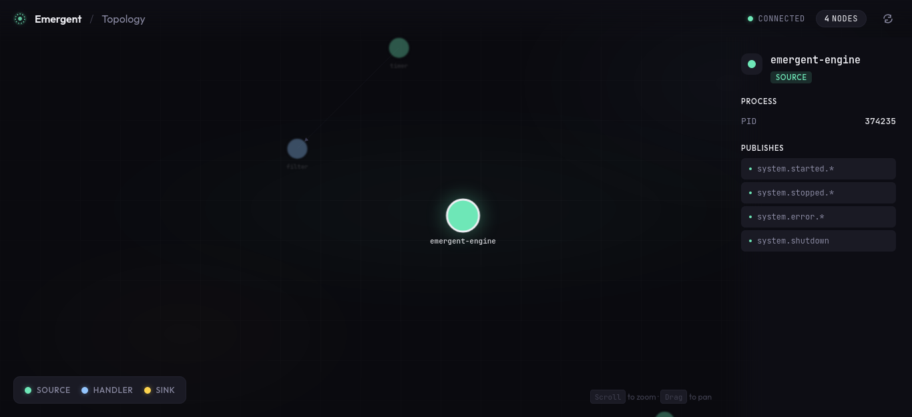

# Emergent

A lightweight event-driven workflow engine with three simple primitives.

Building event-driven systems means coordinating processes that emit, transform, and consume events. Traditional workflow engines add complexity; rolling your own is fragile. Emergent gives you three primitives—Sources emit events, Handlers transform them, Sinks consume them—while the engine handles routing, lifecycle, and observability.

## Quick Start

Install the engine binary and start building pipelines. No Rust toolchain required.

```bash
# Download the latest release (Linux x86_64 shown — see Releases for all platforms)
curl -LO https://github.com/Govcraft/emergent/releases/latest/download/emergent-x86_64-unknown-linux-gnu.tar.gz
tar xzf emergent-x86_64-unknown-linux-gnu.tar.gz
sudo mv emergent /usr/local/bin/

# Create a config file
emergent init

# Install a pre-built primitive from the marketplace
emergent marketplace install http-source
emergent marketplace install console-sink

# Run the pipeline
emergent --config ./emergent.toml
```

No code written. The engine managed process lifecycle, message routing, and graceful shutdown.

## The Three Primitives

```
Source ──publish──> Handler ──transform──> Sink
  │                    │                     │
  └── publish only ────┴── sub + publish ────┴── subscribe only
```

| Primitive | Subscribe | Publish | Purpose |
|-----------|-----------|---------|---------|
| Source    | No        | Yes     | Ingress: emit events into the system |
| Handler   | Yes       | Yes     | Transform: process and re-emit events |
| Sink      | Yes       | No      | Egress: consume events (logs, HTTP, etc.) |

## Built-in Primitives

The [marketplace](https://github.com/Govcraft/emergent-primitives) ships pre-built primitives you can install and use without writing any code:

| Primitive | Kind | Description |
|-----------|------|-------------|
| `http-source` | Source | Generic HTTP webhook receiver |
| `exec-source` | Source | Execute shell commands and emit output as events |
| `exec-handler` | Handler | Pipe event payloads through any executable |
| `console-sink` | Sink | Output message payloads to stdout |
| `http-sink` | Sink | Make outbound HTTP requests |
| `topology-viewer` | Sink | Real-time D3.js workflow visualization |

```bash
# Browse the marketplace
emergent marketplace list

# Install a primitive
emergent marketplace install http-source

# See what a primitive does
emergent marketplace info exec-handler
```

## Zero-Code Pipeline Example

Receive HTTP webhooks, pipe them through a shell command, and print the results—no code required:

```toml
[engine]
name = "webhook-pipeline"
socket_path = "auto"

[[sources]]
name = "webhooks"
path = "~/.local/share/emergent/bin/http-source"
args = ["--port", "8080"]
publishes = ["http.request"]

[[handlers]]
name = "process"
path = "~/.local/share/emergent/bin/exec-handler"
args = ["--publish-as", "processed.result"]
subscribes = ["http.request"]
publishes = ["processed.result"]

[[sinks]]
name = "output"
path = "~/.local/share/emergent/bin/console-sink"
args = ["--subscribe", "processed.result", "--pretty"]
subscribes = ["processed.result"]
```

```bash
emergent --config ./emergent.toml
```

## Write Your Own Primitives

When built-in primitives aren't enough, write your own in any supported language. The SDKs for Rust, TypeScript, and Python expose identical patterns.

### Scaffold a Primitive

```bash
# Interactive wizard — pick your language, primitive type, and message types
emergent scaffold

# Or use flags for scripting
emergent scaffold -t handler -n my_filter -l python -S timer.tick -p timer.filtered
```

### TypeScript

```typescript
import { runSink } from "jsr:@govcraft/emergent";

await runSink("my_sink", ["sensor.reading"], async (msg) => {
  const data = msg.payloadAs<{ temperature: number }>();
  console.log(`Temperature: ${data.temperature}°F`);
});
```

### Python

```python
from emergent import run_handler, create_message

async def enrich(msg, handler):
    data = msg.payload_as(dict)
    enriched = {**data, "processed_by": "python"}
    await handler.publish(
        create_message("data.enriched").caused_by(msg.id).payload(enriched)
    )

import asyncio
asyncio.run(run_handler("enricher", ["data.raw"], enrich))
```

### Rust

```rust
use emergent_client::{EmergentSource, EmergentMessage};
use serde_json::json;

#[tokio::main]
async fn main() -> Result<(), Box<dyn std::error::Error>> {
    let source = EmergentSource::connect("my_source").await?;

    let message = EmergentMessage::new("sensor.reading")
        .with_payload(json!({"temperature": 72.5}));

    source.publish(message).await?;
    Ok(())
}
```

## Features

- **Language-agnostic primitives**: Write in Rust, TypeScript, or Python—or use pre-built marketplace primitives with no code at all
- **Built-in marketplace**: Install community primitives as pre-built binaries with `emergent marketplace install`
- **Scaffold command**: Generate new primitives from templates in any supported language
- **Built-in event sourcing**: Every message logged with causation chains for debugging and replay
- **Graceful lifecycle management**: Engine handles startup ordering, subscription routing, three-phase shutdown
- **Simple IPC protocol**: MessagePack over Unix sockets—no distributed systems setup
- **TOML configuration**: Declare your pipeline topology in one readable file

## Topology Viewer

The built-in topology viewer shows your running pipeline — nodes, subscriptions, and process state — in real time.



```bash
emergent marketplace install topology-viewer
```

## Documentation

- **[Getting Started](docs/getting-started.md)** - Build your first pipeline
- **[Concepts](docs/concepts.md)** - Architecture, message flow, event sourcing
- **[Primitives](docs/primitives/)** - Reference for Sources, Handlers, Sinks
- **[Configuration](docs/configuration.md)** - All configuration options
- **[SDKs](docs/sdks/)** - Rust, TypeScript, Python

## Requirements

The engine is a single pre-built binary. No Rust toolchain required.

To write your own primitives, install the SDK for your language:
- **TypeScript**: Deno 1.40+
- **Python**: Python 3.11+ with uv
- **Rust**: Rust 1.75+

## License

MIT
