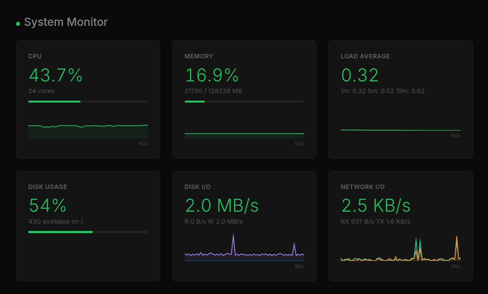

# Emergent

Compose AI-powered automations from CLI tools -- no framework required.

Any command-line tool -- an LLM, a classical ML model, a curl call to an API, a jq transformation -- becomes a composable building block. Wire them together in a TOML file. Emergent handles process lifecycle, message routing, and graceful shutdown. No Python framework. No boilerplate servers. No lock-in.

## What Makes This Different

| | LangChain / CrewAI | N8N / Make.com / Zapier | Bash scripts | Emergent |
|---|---|---|---|---|
| Add a new tool | Learn framework abstractions | Wait for a connector or write a custom node | Edit fragile glue code | If it has a CLI, it already works |
| Add a new model | Write an integration class | Use their AI node (limited models) | Change one command | Change one `args` line |
| Process crashes | Takes down the chain | Node fails, workflow retries from scratch | Silent failure, zombie processes | Isolated -- rest of pipeline stays alive |
| Graceful shutdown | Framework-dependent | Platform-managed (no control) | `kill -9` and hope | Three-phase drain, zero message loss |
| Language lock-in | Python only | JavaScript snippets (N8N) or none (Zapier/Make) | Bash only | Any language, any tool |
| Persistent connections | Custom async code | Not supported (trigger-and-run) | Manual backgrounding | WebSocket handler as a marketplace primitive |
| Feedback loops | Impossible (DAG) | Impossible (DAG) | Fragile (named pipes) | Native pub-sub routing |
| Version control | Python files in git | JSON blobs in a database | Shell scripts in git | TOML in git -- `git diff` shows topology changes |
| Infrastructure | Python runtime | Docker + PostgreSQL (N8N) or SaaS-only (Make/Zapier) | None, but no lifecycle | Single binary, no dependencies |
| Cost model | Free / API costs | Per-execution pricing or seat licenses | Free | Free |

## Patterns Other Frameworks Can't Express

Most workflow tools are DAG-based: directed acyclic graphs where data flows one way through a fixed sequence. Emergent uses pub-sub routing instead, which removes structural constraints that DAGs impose. Combined with process-per-primitive isolation and system event broadcasting, this enables patterns that are difficult or impossible in other tools.

### Feedback Loops

The [ouroboros example](config/examples/ouroboros-loop.toml) subscribes to its own output and feeds it back to the input — an infinite loop with an incrementing counter. DAG-based systems (Airflow, Step Functions, LangChain chains, N8N, Make.com, Zapier) forbid cycles by definition. Emergent's pub-sub routing has no such restriction: any primitive can subscribe to any message type, including those produced downstream.

```
http-source ──> handler (increment) ──> sink (print)
     ^                                └─> sink (curl back to source)
     └────────────────────────────────────┘
```

### System Events as Application Triggers

The engine broadcasts lifecycle events (`system.started.*`, `system.stopped.*`, `system.error.*`) into the same pub-sub fabric as application messages. Primitives can subscribe to them like any other event. The ouroboros loop seeds itself from `system.started.webhook` — no manual trigger, no external scheduler, no health-check polling. A handler could start processing only after a database sink reports ready, or alert when a source fails.

In Kubernetes you'd need readiness probes, init containers, and a separate monitoring stack. In Airflow you'd need an ExternalTaskSensor. Here it's one subscription line.

### Bidirectional Protocol Bridging

The [slack-bot](config/examples/slack-bot.toml) maintains a persistent WebSocket connection to Slack and bridges it into the pub-sub fabric. Inbound WebSocket frames become events. Publishing to a topic sends frames back over the same connection. This bridges WebSocket ↔ pub-sub ↔ HTTP in one TOML file.

This pattern works for any persistent-connection protocol: MQTT, gRPC streams, SSE. The websocket-handler is a reusable marketplace primitive — not custom integration code. In LangChain or CrewAI you'd need a separate WebSocket server, a queue, and glue code to connect them. In Airflow, Step Functions, N8N, Make.com, and Zapier, persistent connections are impossible — they're trigger-and-run systems that execute a workflow and exit. They cannot maintain a WebSocket that stays open across messages.

### Heterogeneous Fan-In Without Coordination

The [system-monitor](config/advanced-examples/system-monitor/) runs six sources polling different metrics at different intervals (CPU every 1s, disk every 2s). All converge on one handler with no merge node, no barrier, no synchronization — just subscription matching. Add a seventh metric source by adding one `[[sources]]` block. The handler and sinks don't change.

In Step Functions this requires a Parallel state with explicit branches and a join. In Airflow you need a join task. In N8N or Make.com you'd need a Merge node and carefully ordered branches. In bash you need background processes writing to named pipes. Here the engine handles routing.

### Polyglot Per-Step, Same Pipeline

The advanced examples use three different handler implementations in one project:

- **jq** via exec-handler for trivial JSON transforms (basic-pipeline)
- **Python** SDK handler for stateful computation (game-of-life, system-monitor)
- **Rust** script handler with rayon parallelism for compute-heavy simulation (reaction-diffusion)

All share the same message fabric, the same lifecycle management, the same event store. Pick the right tool for each step. AI frameworks are Python-only. N8N limits custom code to JavaScript snippets inside Code nodes. Make.com and Zapier limit you to their built-in connectors — if a connector doesn't exist, you're stuck with an HTTP request node and custom parsing. Container orchestrators can do polyglot but add per-step overhead (image pulls, container startup, networking). Emergent primitives are processes connected by Unix sockets — startup is instant.

### Process Crash Isolation

Each primitive runs as its own process. If step 7 (the LLM call) in the slack-bot hangs for 60 seconds, steps 1–6 and 8 keep running. The WebSocket stays connected. Slack envelopes keep getting acknowledged. Other messages queue up. When the LLM responds, the pipeline resumes.

In LangChain, a hung API call blocks the entire chain. In a bash pipeline, a hung command blocks the pipe. In Emergent, crash isolation is structural — you get it for free from the process-per-primitive model.

### Configuration as Complete Topology

The TOML file is the entire pipeline architecture. Every source, handler, sink, subscription, and publication is declared in one file. `git diff` shows exactly what changed. Code review covers both logic and topology in the same PR. There is nothing else to check — no scattered service configs, no class hierarchies, no DAG builder API.

N8N stores workflows as JSON in a PostgreSQL database. Make.com and Zapier store them in their cloud — you cannot export, diff, or version-control them meaningfully. Emergent workflows are plain text files that live in your repository alongside your code.

## Quick Start

```bash
# Arch Linux (AUR)
yay -S emergent-bin

# Cargo (any platform with Rust toolchain)
cargo install emergent-engine

# Or download a pre-built binary (Linux, macOS)
curl -LO https://github.com/Govcraft/emergent/releases/latest/download/emergent-x86_64-unknown-linux-gnu.tar.gz
tar xzf emergent-x86_64-unknown-linux-gnu.tar.gz
sudo mv emergent /usr/local/bin/

# Install pre-built primitives from the marketplace
emergent marketplace install exec-source exec-handler exec-sink
```

## The Slack Bot: An AI Chatbot in Pure TOML

This is an 8-step Claude-powered Slack chatbot. It connects via WebSocket, receives messages, sends them to Claude, and posts responses back. Zero application code -- just TOML, jq, curl, and a model call.

```
slack-connect ──> url-extractor ──> slack-ws ──> slack-ack (auto-ack envelopes)
                                       │
                                       └──> slack-extract ──> prepare-prompt ──> claude-respond ──> slack-poster
```

The key step -- sending a message to Claude -- is one exec-handler:

```toml
[[handlers]]
name = "claude-respond"
path = "~/.local/share/emergent/primitives/bin/exec-handler"
args = [
    "-s", "slack.prompt",
    "--timeout", "60000",
    "--",
    "sh", "-c",
    "input=$(cat) && channel=$(echo \"$input\" | jq -r .channel) && text=$(echo \"$input\" | jq -r .text) && response=$(echo \"$text\" | claude -p 2>/dev/null) && jq -nc --arg channel \"$channel\" --arg text \"$response\" '{channel: $channel, text: $text}'"
]
subscribes = ["slack.prompt"]
publishes = ["slack.post"]
```

Want to use Ollama instead of Claude? Change one line:

```toml
# Claude
"... response=$(echo \"$text\" | claude -p 2>/dev/null) ..."

# Ollama (local)
"... response=$(echo \"$text\" | curl -s http://localhost:11434/api/generate -d \"{\\\"model\\\": \\\"llama3\\\", \\\"prompt\\\": \\\"$text\\\", \\\"stream\\\": false}\" | jq -r .response) ..."

# OpenAI-compatible API
"... response=$(echo \"$text\" | curl -s https://api.openai.com/v1/chat/completions -H \"Authorization: Bearer $OPENAI_API_KEY\" -H 'Content-Type: application/json' -d \"{\\\"model\\\": \\\"gpt-4\\\", \\\"messages\\\": [{\\\"role\\\": \\\"user\\\", \\\"content\\\": \\\"$text\\\"}]}\" | jq -r '.choices[0].message.content') ..."
```

The model behind the handler is incidental. Emergent manages the process, routes the messages, and handles the lifecycle. It does not know or care whether a handler runs a 400B parameter LLM or a hand-tuned regex.

[Full slack-bot config](config/examples/slack-bot.toml) | [Setup instructions](docs/examples.md#slack-bot)

## Tool-Agnostic by Design

The exec-handler pipes event payloads through any executable's stdin and publishes stdout as a new event. The tool is your choice:

```toml
# LLM: Claude CLI
args = ["--", "claude", "-p", "Summarize this JSON data"]

# LLM: Local Ollama via curl
args = ["--", "sh", "-c", "curl -s http://localhost:11434/api/generate -d '{\"model\":\"llama3\",\"prompt\":'$(cat)',\"stream\":false}' | jq .response"]

# Classical ML: Python scikit-learn model
args = ["--", "python3", "predict.py"]

# Data transformation: jq
args = ["--", "jq", ".data | map(select(.score > 0.8))"]

# System utility: any Unix command
args = ["--", "wc", "-l"]
```

Every tool gets the same lifecycle management, message routing, graceful shutdown, and event sourcing. Add a new step to your pipeline by adding a few lines of TOML. Remove a step by deleting them.

## How It Works: Three Primitives

```
Source ──publish──> Handler ──transform──> Sink
  │                    │                     │
  publish only         sub + publish         subscribe only
```

| Primitive | Subscribe | Publish | Purpose |
|-----------|-----------|---------|---------|
| Source    | No        | Yes     | Ingress: emit events (timers, webhooks, APIs) |
| Handler   | Yes       | Yes     | Transform: process and re-emit (filter, enrich, model call) |
| Sink      | Yes       | No      | Egress: consume events (logs, dashboards, API calls) |

That is the entire model. Every workflow is a composition of these three types. Sources cannot receive messages. Sinks cannot produce them. Handlers do both. This constraint makes pipelines predictable: you can read the TOML config and understand exactly what data flows where.

## Marketplace: Pre-Built Primitives

Install pre-built primitives and compose pipelines without writing code:

```bash
emergent marketplace list
emergent marketplace install exec-handler
emergent marketplace info exec-handler
```

| Primitive | Kind | Description |
|-----------|------|-------------|
| `exec-source` | Source | Run any shell command on an interval, emit output as events |
| `http-source` | Source | Receive HTTP webhooks |
| `exec-handler` | Handler | Pipe event payloads through any executable |
| `stream-runner` | Handler | Emit a JSON collection one item at a time with ack-based flow control |
| `websocket-handler` | Handler | Bidirectional WebSocket bridge |
| `exec-sink` | Sink | Pipe event payloads through any executable (fire-and-forget) |
| `sse-sink` | Sink | Push events to browsers via Server-Sent Events |
| `topology-viewer` | Sink | Real-time D3.js pipeline visualization |

## Zero-Code Pipeline Examples

### Basic Pipeline

Run `date` every 3 seconds, transform with jq, pretty-print the result:

```toml
[engine]
name = "basic-pipeline"
socket_path = "auto"

[[sources]]
name = "ticker"
path = "~/.local/share/emergent/primitives/bin/exec-source"
args = ["--command", "date", "--interval", "3000"]
publishes = ["exec.output"]

[[handlers]]
name = "transform"
path = "~/.local/share/emergent/primitives/bin/exec-handler"
args = ["-s", "exec.output", "--publish-as", "data.transformed", "--", "jq", "-c", ". + {transformed: true}"]
subscribes = ["exec.output"]
publishes = ["data.transformed"]

[[sinks]]
name = "printer"
path = "~/.local/share/emergent/primitives/bin/exec-sink"
args = ["-s", "data.transformed", "--", "jq", "."]
subscribes = ["data.transformed"]
```

```bash
emergent marketplace install exec-source exec-handler exec-sink
emergent --config ./config/examples/basic-pipeline.toml
```

### AI Chatbot (Slack)

Eight marketplace primitives, zero custom code. See [slack-bot.toml](config/examples/slack-bot.toml).

### Self-Seeding Loop

Subscribes to its own startup event, bootstraps a loop that circulates forever with an incrementing counter. See [ouroboros-loop.toml](config/examples/ouroboros-loop.toml).

### WebSocket Echo

Connects to a WebSocket echo server, sends a message, prints the round-trip response. See [websocket-echo.toml](config/examples/websocket-echo.toml).

## Advanced Examples

Pipelines demonstrating fan-in, fan-out, stateful transformation, and real-time browser visualization.

| Example | What It Demonstrates |
|---------|---------------------|
| [system-monitor](config/advanced-examples/system-monitor/) | Six metric sources fan into a stateful Python handler, fan out to an SSE dashboard and console |
| [game-of-life](config/advanced-examples/game-of-life/) | Conway's Game of Life as a pub-sub pipeline -- gliders emerge from four rules applied to a message stream |
| [reaction-diffusion](config/advanced-examples/reaction-diffusion/) | Gray-Scott Turing patterns computed by a parallel Rust handler, streamed to a browser canvas via SSE |


*Six metric sources fan into a stateful handler, fan out to a live SSE dashboard*


*Gliders and oscillators emerge from four rules applied to a pub-sub message stream*


*Gray-Scott Turing patterns computed by a parallel Rust handler*

```bash
emergent marketplace install exec-source exec-sink sse-sink
emergent --config ./config/advanced-examples/game-of-life/emergent.toml
# Open http://localhost:8082 to watch
```

See the [Examples Guide](docs/examples.md) for full setup instructions and pattern explanations.

## Topology Viewer

See your running pipeline -- nodes, subscriptions, and process state -- in real time:


```bash
emergent marketplace install topology-viewer
```

## Write Your Own Primitives

When exec primitives are not enough -- you need persistent state across messages, custom protocols, or high-performance processing -- write a custom primitive in any supported language. The SDKs for Rust, TypeScript, Python, and Go expose identical patterns.

### Scaffold a Primitive

```bash
# Interactive wizard
emergent scaffold

# Or use flags
emergent scaffold -t handler -n my_filter -l python -S timer.tick -p timer.filtered
```

### TypeScript

```typescript
import { runSink } from "jsr:@govcraft/emergent";

await runSink("my_sink", ["sensor.reading"], async (msg) => {
  const data = msg.payloadAs<{ temperature: number }>();
  console.log(`Temperature: ${data.temperature}`);
});
```

### Python

```python
from emergent import run_handler, create_message

async def enrich(msg, handler):
    data = msg.payload_as(dict)
    enriched = {**data, "processed_by": "python"}
    await handler.publish(
        create_message("data.enriched").caused_by(msg.id).payload(enriched)
    )

import asyncio
asyncio.run(run_handler("enricher", ["data.raw"], enrich))
```

### Rust

```rust
use emergent_client::{EmergentSource, EmergentMessage};
use serde_json::json;

#[tokio::main]
async fn main() -> Result<(), Box<dyn std::error::Error>> {
    let source = EmergentSource::connect("my_source").await?;

    let message = EmergentMessage::new("sensor.reading")
        .with_payload(json!({"temperature": 72.5}));

    source.publish(message).await?;
    Ok(())
}
```

### Go

```go
package main

import (
    "context"
    emergent "github.com/govcraft/emergent/sdks/go"
)

func main() {
    emergent.RunSource("my_source", func(ctx context.Context, source *emergent.EmergentSource) error {
        msg, _ := emergent.NewMessage("sensor.reading")
        msg.WithPayload(map[string]any{"temperature": 72.5})
        return source.Publish(msg)
    })
}
```

## Features

- **Tool-agnostic composition**: Any CLI tool or API call becomes a pipeline building block via exec primitives
- **TOML-as-architecture**: Your config file is your entire pipeline topology -- readable, auditable, versionable
- **Built-in marketplace**: Install pre-built primitives as binaries with `emergent marketplace install`
- **Process isolation**: Each primitive runs as its own process -- a crashed model call cannot take down the pipeline
- **Built-in event sourcing**: Every message logged with causation chains for debugging and replay
- **Graceful lifecycle management**: Three-phase shutdown (sources stop, handlers drain, sinks drain) with zero message loss
- **Polyglot SDKs**: Write custom primitives in Rust, TypeScript, Python, or Go when exec is not enough
- **Simple IPC protocol**: MessagePack over Unix sockets -- no distributed systems setup

## Documentation

- **[Getting Started](docs/getting-started.md)** -- Install, run your first pipeline, extend it
- **[Examples](docs/examples.md)** -- Zero-code pipelines and advanced patterns
- **[Concepts](docs/concepts.md)** -- Architecture, message flow, event sourcing
- **[Primitives](docs/primitives/)** -- Reference for Sources, Handlers, Sinks
- **[Configuration](docs/configuration.md)** -- All configuration options
- **[SDKs](docs/sdks/)** -- Rust, TypeScript, Python, Go

## Requirements

The engine is a single pre-built binary. No Rust toolchain required.

To write custom primitives, install the SDK for your language:
- **TypeScript**: Deno 1.40+
- **Python**: Python 3.11+ with uv
- **Rust**: Rust 1.75+
- **Go**: Go 1.23+

## License

MIT
